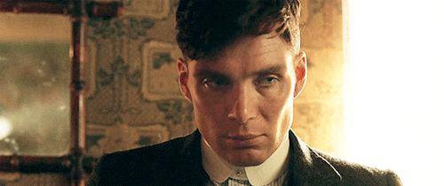

<style>
body {
text-align: justify}
</style>

```{r setup, include=FALSE}

library(tidyverse, warn.conflicts = F)
library(rvest)
library(plotly)
library(cluster)
library(ggdendro)
library(gridExtra)
library(viridis)

source(here::here("code/lib.R"))
theme_set(theme_report())

knitr::opts_chunk$set(tidy = FALSE,
                      fig.width = 6,
                      fig.height = 5,
                      echo = TRUE)
```

```{r, include=FALSE, echo=FALSE, warning=FALSE, message=FALSE}

source("../plota_solucoes_hclust.R")

import_data("cillian_murphy")
filmes <- read_imported_data()

```

<center>

</center>

<center>
<font size="2">Peaky Blinders - BBC Two</font>
</center>

Tendo atuado em mais de 30 filmes desde 1998, Cillian Murphy se destacou em 2005 no papel de Espantalho a.k.a Dr. Jonathan Crane em Batman Begins, transformando-se em um grande ator de Hollywood e firmando uma parceria duradoura com o cineasta Christopher Nolan. 

Tendo em vista seu sucesso, irei realizar uma série de análises descritivas em cima de sua filmografia, levando em conta os dados presentes no [Rotten Tomatoes](https://www.rottentomatoes.com).

#Visão Geral

```{r, echo=FALSE, warning=FALSE, message=FALSE}

filmes[order(filmes$ano),]

```

Com uma rápida olhada nos dados é possível ver que o Rotten Tomatoes conta com apenas 14 dos 32 filmes que constam em sua página da [wikipédia](https://pt.wikipedia.org/wiki/Cillian_Murphy) e portanto irei trabalhar apenas com esses.

#Avaliação e bilheteria

```{r, echo=FALSE, warning=FALSE, message=FALSE}

ggplotly(filmes %>%
    ggplot(aes(x = avaliacao, y = bilheteria, label = filme, label2 = ano)) +
    geom_point() +
    theme_bw() +
    ggtitle("Bilheteria (em Doláres) vs Avaliação do Rotten Tomatoes") +
    theme(plot.title = element_text(hjust = 0.5)), tooltip = c("label", "label2"))

```

Com uma lista extensa de filmes, é fácil de perceber que suas avaliações transitam entre quase os 100% de aprovação e também chega a beirar o zero, tendo pontos por toda a extensão do gráfico, seria possível criar subgrupos de filmes levando em conta as sua avaliações? E quanto a suas bilheterias? Fácilmente podemos ver que grande parte está abaixo dos 100 milhões.

#Agrupamento

Tendo em mente a existência de diferentes subgrupos de filmes, eu irei realizar um processo de agrupamento nos dados e então decidirei quantos subgrupos existem e quais são eles, mas antes é necessário entender que a presença de escalas diferentes para as avaliações e bilheterias pode comprometer o processo de agrupamento e portanto usarei a escala de log10 para a bilheteria.

##Definindo grupos

```{r, echo=FALSE, warning=FALSE, message=FALSE}

agrupamento <- filmes %>%
    mutate_at(vars(bilheteria, avaliacao), funs(scale)) %>%
    as.data.frame() %>%
    column_to_rownames("filme") %>%
    select(avaliacao, bilheteria) %>%
    dist(method = "euclidean") %>%
    hclust(method = "ward.D")

get_grupos <- function(agrupamento, num_grupos){
    agrupamento %>% 
        cutree(num_grupos) %>% 
        as.data.frame() %>% 
        mutate(label = rownames(.)) %>% 
        gather(key =  "k", value = "grupo", -label) %>% 
        mutate(grupo = as.character(grupo))
}

ggdendrogram(agrupamento, rotate = T, size = 2, theme_dendro = T) + 
    labs(x = "", y = "") +
    ggtitle("Dissimilaridade entre os filmes") +
    theme(plot.title = element_text(hjust = 0.5))

```

Através da visualização do dendograma é possível ver a formação de alguns subgrupos, Anthropoid e Free Fire formam um grupo com 2 componentes, por exemplo. A medida que o gráfico avança para a direita o número de grupos vai diminuindo, porém os filmes em um mesmo grupo não passam a ser tão próximos entre si. Eu diria que parar com 3 é uma boa escolha.

##Plotando grupos

```{r, echo=FALSE, warning=FALSE, message=FALSE}

atribuicoes = get_grupos(agrupamento, num_grupos = 1:6)

atribuicoes = atribuicoes %>% 
    left_join(filmes, by = c("label" = "filme"))

ggplotly(atribuicoes %>%
    filter(k == 3) %>%
    ggplot(aes(x = avaliacao, y = bilheteria, label = label, label2 = ano)) +
    geom_point(aes(color = grupo), show.legend = FALSE) +
    theme_bw() +
    ggtitle("Os 3 tipos de filme de Cillian Murphy") +
    theme(plot.title = element_text(hjust = 0.5), legend.title=element_blank()), tooltip = c("label", "label2"))

```

Através do gráfico acima é possível ver facilmente os 3 grupos definidos com a ajuda do dendograma e como eles estão posicionados.

O primeiro grupo trata-se dos <span style="color:blue">grandes fracassos</span>, filmes que se mostraram um fiasco em termos de crítica e bilheteria, passando sequer dos 50% de aprovação e provando que nem só de sucessos os grandes atores vivem. O maior representante desse grupo é [Transcendence](https://www.rottentomatoes.com/m/transcendence_2014/), um filme de ficção científica com um ótimo elenco, mas que se mostrou um desastre em roteiro.

<center>

</center>

<center>
<font size="2">Peaky Blinders - BBC Two</font>
</center>


Logo em seguida as <span style="color:green">apostas</span>, filmes que tiveram avaliações ótimas e até excelentes entre a crítica especializada como [The Wind That Shakes The Barley](https://www.rottentomatoes.com/m/wind_that_shakes_the_barley/), mas que terminaram não caindo nas graças do público, faturando menos de 100 milhões e mostrando que nem sempre bons roteiros ou ótimas atuações podem salvar um filme do fracasso nos cinemas. 

Por último, os <span style="color:red">Blockbusters</span>, filmes que além de terem sido um sucesso entre a crítica também tiveram um ótimo faturamento. Frutos de uma parceria entre Murphy e Nolan que começou em 2005 com o primeiro filme da trilogia "O cavaleiro das trevas" e dura até hoje, tendo o excelente [Dunkirk](https://www.rottentomatoes.com/m/dunkirk_2017/) como o mais recente filme do diretor Christopher Nolan, no qual Cillian atua no papel de um soldado traumatizado pela guerra.


